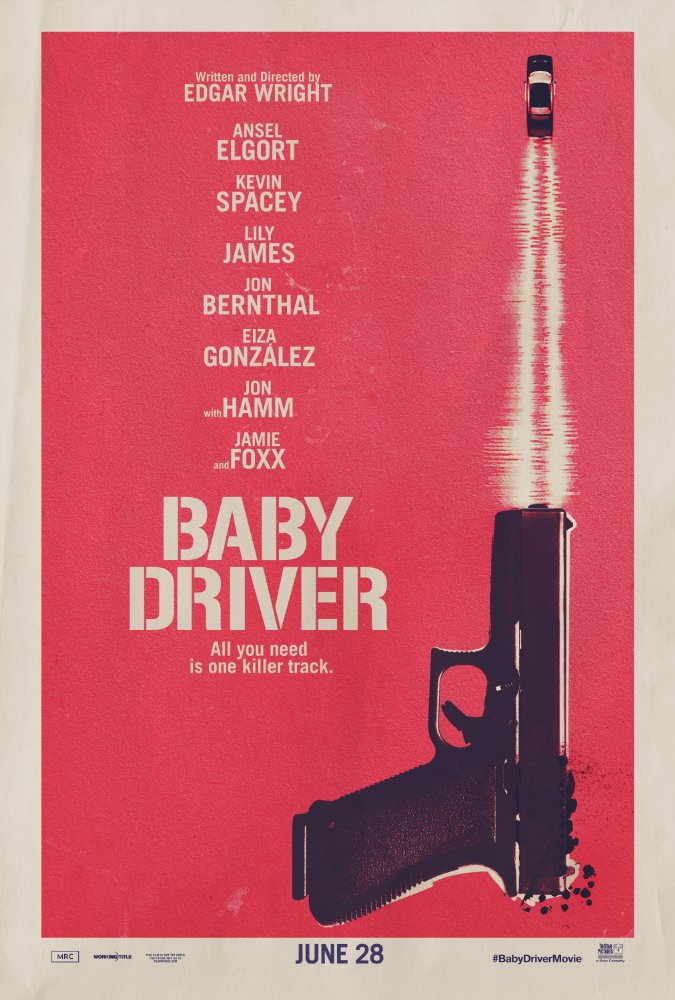

Action Films
============

Looking for a film that blow you away with huge explosions, extravagant cars, and knock down drag out fights? From your favorite superhero film to the summer blockbuster explosion-stravaganza HAAB has you covered!

See our Selection below:

+-------------------------------------+------------+----------+-----------+---------+
| Film Title                          | Year       | MPAA     | Run Time  | HAAB    |
|                                     | Released   | Rating   |           | Review  |
+=====================================+============+==========+===========+=========+
| Baby Driver                         | 2017       | R        | 1hr 52min | 8/10    |
+-------------------------------------+------------+----------+-----------+---------+
| Captain America: The Winter Soldier | 2014       | PG-13    | 2hr 16min | 9/10    |
+-------------------------------------+------------+----------+-----------+---------+
| Saving Private Ryan                 | 1998       | R        | 2hr 33min | 8/10    |
+-------------------------------------+------------+----------+-----------+---------+

**Baby Driver (2017)**
----------------------

*Description:*
~~~~~~~~~~~~~~

When talented driver, Baby (Ansel Elgort), is forced into a string of robberies as the getaway driver, music becomes both his inspiration for his fanatic driving, as well as, his only escape from the shady life he leads. That is until he meets Debora (Lily James), a simple sweet waitress that could be the very key to convincing Baby to fianlly leave his old road behind. 

**Starring:** Ansel Elgort, Kevin Spacey, Lily James, Lily James, Jon Bernthal, Eliza Gonzalez, John Hamm, and Jamie Foxx.

**Directed by:** Edgar Wright

**Producer:** Big Talk Productions & Working Title Films

**Run Time:** 1hr 52min

**MPAA Rating:** Rated R, Violence & Adult Language throughout

**HAAB Review:** Baby driver is an intense adventure of cars, hesits, love, and music. In terms of action sequencing, the scenes with Baby maneuvering in and out of heavy traffic in spectacular driving stunts are a wonder to behold and thrilling throuh every bend and turn. The acting, for the most part, is immaculate. John Hamm delivers a chest tightening performance in the film's second act which more than makes up for Ansel Elgort's wavering southern accent. Elgort does, however, create a fleshed out Baby that is very human in his flaws though admirable in character. If you need one single reason to see this film then look no further than the soundtrack. The score is comprised of classic tunes and incredible remixes that make the film simply fun to listen to. The opening sequence of the film combines this energetic score with artistic cinematography that evereyone should have the chance to see! 

Check out the trailer for `Baby Driver`_ !

.. _Baby Driver: https://www.youtube.com/watch?v=z2z857RSfhk

**If you like Baby Driver you may also like:**

* Guardians of the Galaxy
* Scott Pilgrim vs. The World
* Atomic Blonde

