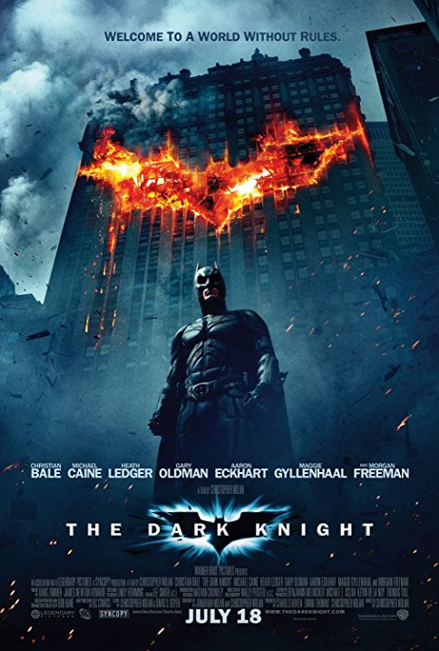
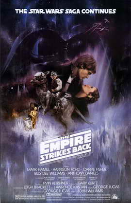
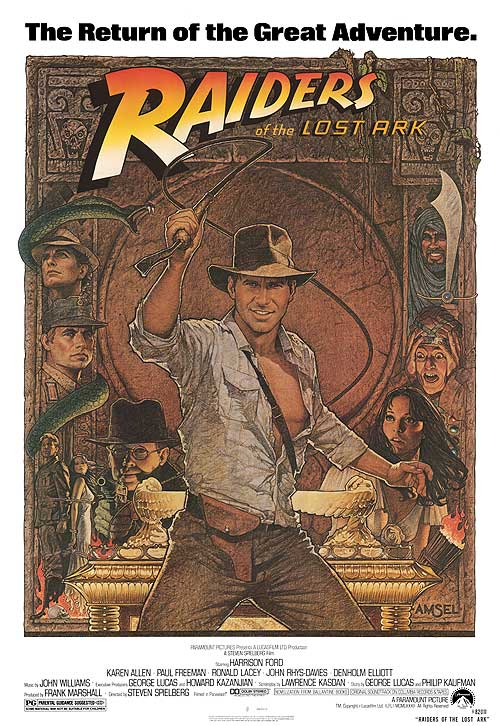
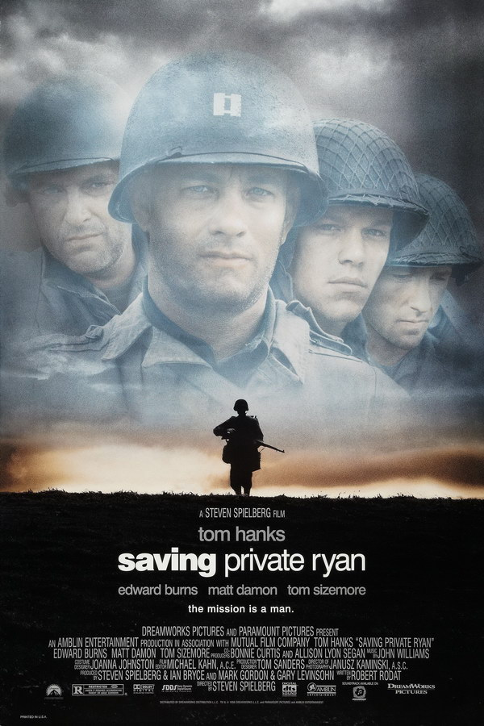

Action Films
============

Looking for a film that will blow you away with huge explosions, extravagant cars, and knock down drag out fights? 
From your favorite superhero film to the summer blockbuster explosion-extravaganza HAAB has you covered!

See our Selection below:

+--------------------------+------------+----------+-----------+---------+
| Film Title               | Year       | MPAA     | Run Time  | HAAB    |
|                          | Released   | Rating   |           | Review  |
+==========================+============+==========+===========+=========+
| :ref:`TDK`               | 2008       | PG-13    | 2hr 32min | 9/10    |
+--------------------------+------------+----------+-----------+---------+
| :ref:`EmpireStrikesBack` | 1980       | PG       | 2hr 4min  | 8/10    |
+--------------------------+------------+----------+-----------+---------+
| :ref:`RaidersLostArk`    | 1981       | PG       | 1hr 55min | 8/10    |
+--------------------------+------------+----------+-----------+---------+
| :ref:`LoTRKing`          | 2003       | PG-13    | 3hr 21min | 8/10    |
+--------------------------+------------+----------+-----------+---------+
| :ref:`SavingPrivateRyan` | 1998       | R        | 2hr 49min | 8/10    |
+--------------------------+------------+----------+-----------+---------+

.. _TDK:

The Dark Knight
---------------

Description:
~~~~~~~~~~~~

In the criminal underworld of Gotham, a new name has come to town. The Joker (Heath Ledger) is the force of chaos 
personified to combat Batman's (Christian Bale) force of Justice. What this seeming trickster lacks in subtlety, he 
makes up for in his ingenious plans to push the Caped Crusader to the breaking point.

**Starring:** Christian Bale, Heath Ledger, Aaron Eckhart

**Directed by:** Christopher Nolan

**Run Time:** 2hr 32min

**MPAA Rating:** Rated R; Violence & Menace.

Check out the trailer for `The Dark Knight`_!

.. _The Dark Knight: https://www.youtube.com/watch?v=_PZpmTj1Q8Q

**If you like The Dark Knight you may also like:**

* *Batman Begins*
* *The Dark Knight Rises*
* *Inception*

.. _EmpireStrikesBack:

The Empire Strikes Back
-----------------------

Description:
~~~~~~~~~~~~

Though the Death Star has been destroyed the Empire is far from overthrown. They still scour the galaxy looking to 
snuff out the Rebel Alliance. Luke has not forgotten his master Obi-wan and seeks to further his Jedi training with 
another refugee Jedi, all the while being hunted by Darth Vader.

**Starring:** Mark Hamill, Harrison Ford, Carrie Fisher, 

**Directed by:** Irvin Kershner

**Run Time:** 2hr 4min

**MPAA Rating:** Rated PG; Sci-Fi Action Violence.

Check out the trailer for `The Empire Strikes Back`_!

.. _The Empire Strikes Back: https://www.youtube.com/watch?v=96v4XraJEPI

**If you like The Empire Strikes Back you may also like:**

* *Star Wars (Episode IV: A New Hope)*
* *Star Wars Episode VII: The Force Awakens*
* *Raiders of The Lost Ark*

.. _RaidersLostArk:

Raiders of the Lost Ark
-----------------------

Description:
~~~~~~~~~~~~

Professor and archaeologist Indiana Jones is hired by the US Government to uncover and collect the Ark of the Covenant 
before the Nazis can get their hands on the artifact for their own nefarious purposes.

**Starring:** Harrison Ford, Karen Allen, Paul Freeman 

**Directed by:** Steven Spielberg

**Run Time:** 1hr 55min

**MPAA Rating:** Rated PG; none given.

Check out the trailer for `Raiders of the Lost Ark`_!

.. _Raiders of the Lost Ark: https://www.youtube.com/watch?v=XkkzKHCx154

**If you like Raiders of the Lost Ark you may also like:**

* *Star Wars (Episode IV: A New Hope)*
* *Indiana Jones & The Temple of Doom*
* *E.T.*

.. _LoTRKing:

The Lord of the Rings: The Return of the King
---------------------------------------------
.. image:: images/return_of_the_king.jpg
    :width: 50%

Description:
~~~~~~~~~~~~

Based off the final portion of J.R.R Tolkien's epic; *The Lord of the Rings*, the quest to destroy the one ring and 
bring peace back to Middle Earth continues. The fellowship has been separated among two factions. Sam and Frodo 
continue their march to Mount Doom to destroy the ring, while Legolas, Aragorn, Gandalf, and Gimli try to fend off the 
servants of Sauron and protect the city of Gondor.

**Starring:** Elijah Wood, Viggo Mortenson, Ian McKellen 

**Directed by:** Peter Jackson

**Run Time:** 3hr 21min

**MPAA Rating:** Rated PG-13; Intense Battle Sequences & Frightening Images.

Check out the trailer for `The Lord of the Rings The Return of the King`_!

.. _The Lord of the Rings The Return of the King: https://www.youtube.com/watch?v=r5X-hFf6Bwo

**If you like The Lord of the Rings: The Return of the King you may also like:**

* *The Lord of the Rings: Fellowship of the Ring*
* *Conan the Barbarian*
* *District 9*

.. _SavingPrivateRyan:

Saving Private Ryan
-------------------

Description:
~~~~~~~~~~~~

Based of an increible true story, following the events of D-Day: Normany, a young soldier has earned the right to go 
home under the Sole Survivor Policy after losing his brothers in the war. Captain Miller (Tom Hanks), has been 
assigned to track down and find Private Ryan (Matt Damon) and bring him home despite the waging war surrounding them 
all.

**Starring:** Tom Hanks, Matt Damon, Tom Sizemore

**Directed by:** Steven Spielberg

**Run Time:** 2hr 49min

**MPAA Rating:** Rated R; Intense Graphically Realistic Violence & Adult Language

Check out the trailer for `Saving Private Ryan`_!

.. _Saving Private Ryan: https://www.youtube.com/watch?v=RYID71hYHzg

**If you like Saving Private Ryan you may also like:**

* *Dunkirk*
* *Forrest Gump*
* *Schindler's List*