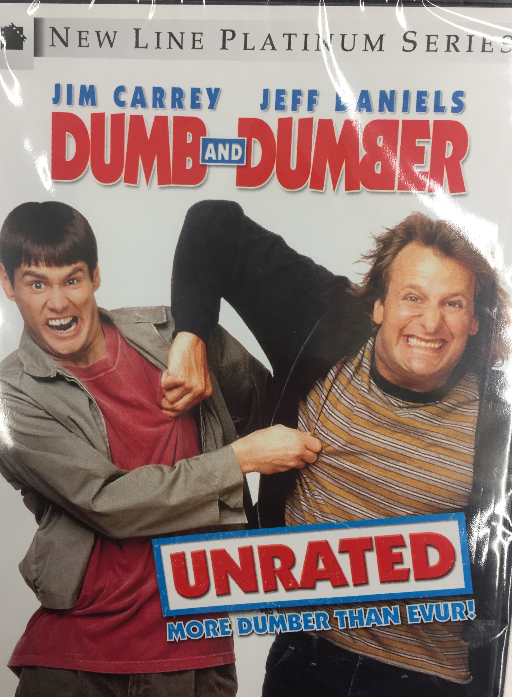

Addie's favorites
=============

Welcome to my **favorites page**. 

There have been many movies out this past year but few have been 
good enough to see in my opinion. 2017 did not come out with any 
films that are my new favorite. My forever favorite film will be
Dumb and Dumber. I prefer simple comedy. I like to just sit back
and watch a film without feeling emotionally stressed. Dumb and 
Dumber is the perfect film to watch anytime of the day when you
want a good laugh.

**Description:** Lloyd and Harry are two poor guys who are a little slow in the
head. Lloyd is a limo driver and one of his clients, Mary, leaves
her suitcase in the airport. Lloyd grabs her suitcase and chases 
after her but he is too late. He decides that him and his best 
friend Harry will set out to Aspen to deliver the suitcase back
to her personally. Along the way, they have a crazy cross country
trip from Providence to Aspen, Colorado. 

**Starring:** Jim Carrey, Jeff Daniels, Lauren Holly, Karen Duffy, and
Charles Rocket 

**Run Time:** 1hr 53min

Here is a little bit about the movie:

+-------------------+------------+----------+-----------+---------+
| Film Title        | Year       | MPAA     | Run Time  | Addie's |
|                   | Released   | Rating   |           | Review  |
+===================+============+==========+===========+=========+
| `Dumb and Dumber` | 1994       | PG-13    | 1hr 53min | 10/10   |
+-------------------+------------+----------+-----------+---------+

Here is the trailer for the movie `Dumb and Dumber`_ 

.. _Dumb and Dumber: https://www.youtube.com/watch?v=MSu25pQ4iFw

**Why Dumb and Dumber is one of my favorite films**

Jim Carrey and Jeff Daniels make a hilarious combination. They work well together
and made a fantastic movie. In my opinion, it's the best comedy of all time. 
My friends, family and I all quote Dumb and Dumber all of the time. To me, being
able to quote something funny from a movie and having the other person understand 
what I am referencing makes the movie that much better. While the first Dumb and Dumber
will forever be a classic film, the second Dumb and Dumber was a huge disappointment.
This squeal was called Dumber and Dumber To. This film had a lot of crude humor and was
not nearly as funny as the first one. The filmmakers of Dumb and Dumber should have just
left it at one film. It's a fact the the sequels are never as good as the original films. 
