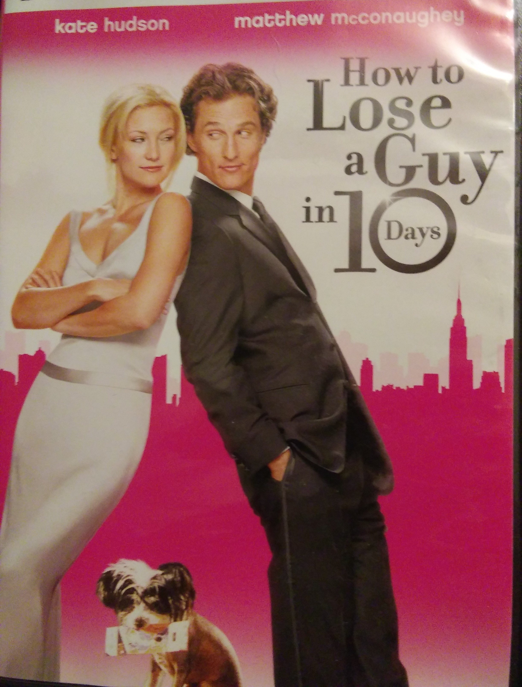
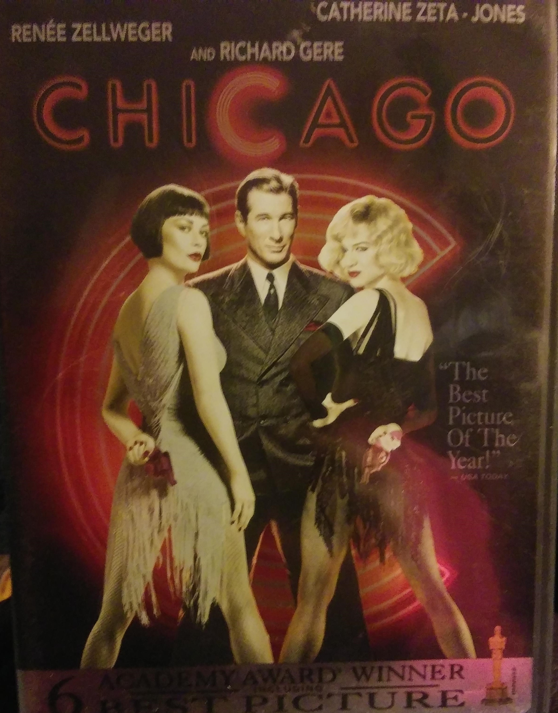
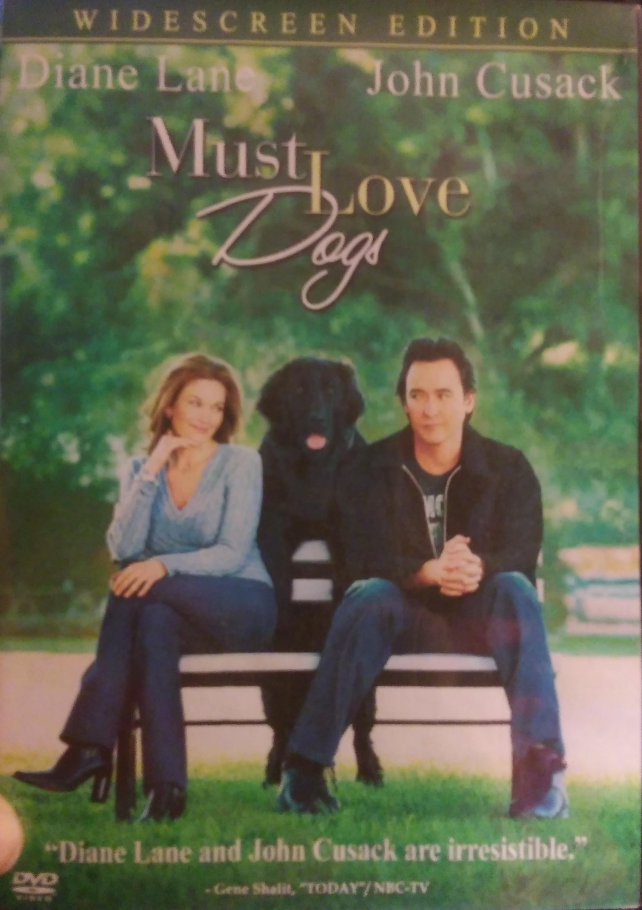

Angela's Favorites
==================

As a member of Generation X, I tend to enjoy the older movies. I have had my
share of relationships and my favorites reflect those women who haven't
quite gotten the marriage scene down yet, much like myself.  Below are a 
few of my favorite movies with strong leading ladies.

See our Selection below:

+-----------------------+------------+----------+-----------+---------+
| Film Title            | Year       | MPAA     | Run Time  | HAAB    |
|                       | Released   | Rating   |           | Review  |
+=======================+============+==========+===========+=========+
| :ref:`how`            | 2003       | PG-13    | 1hr 56min | 6/10    |
+-----------------------+------------+----------+-----------+---------+
| :ref:`chi`            | 2002       | PG-13    | 1hr 53min | 7/10    |
+-----------------------+------------+----------+-----------+---------+
| :ref:`must`           | 2005       | PG-13    | 1hr 38min | 6/10    |
+-----------------------+------------+----------+-----------+---------+

.. _how:

How to Lose a Guy in 10 Days 
----------------------------

*Description:*
~~~~~~~~~~~~~~

Benjamin Barry is an advertising executive and ladies' man who, to win a 
big campaign, bets that he can make a woman fall in love with him in 10 
days. Andie Anderson covers the "How To" beat for "Composure" magazine and 
is assigned to write an article on "How to Lose a Guy in 10 days." They
meet in a bar shortly after the bet is made. Cited from IMDb

**Starring:** Kate Hudson, Matthew McConaughey, Kathryn Hahn, 
Annie Parisse, Adam Goldberg, Micheal Michele.

**Directed by:** Donald Price

**Run Time:** 1hr 56min

**MPAA Rating:** Rated PG-13 for some sex-related material

HAAB Review: How to Lose a Guy in 10 Days, is absolutely my favorite
movie.  I love the chemistry between the leading actors Kate Hudson, and 
Mathew McConaughey.  This story makes you laugh, cry, and leaves you 
wanting a sequel.  The whole idea of what common mistakes woman make to 
lose a guy would have worked if it had not been for those sneaky, 
co-workers from the advertising firm.  You can't help but fall in love with
this couple.

Check out the trailer for `How to Lose a Guy in 10 Days`_!

.. _How to lose a Guy in 10 days: https://www.youtube.com/watch?v=EFGr2_cOOTk

**If you like How To Lose a Guy in 10 Days, you may also like:**

* Sweet Home Alabama
* The Wedding Date
* Just Like Haven

.. _chi:

Chicago 
-------

*Description:*
~~~~~~~~~~~~~~

Murderesses Velma Kelly and Roxie Hart find themselves on death row 
together and fight for the fame that will keep them from the gallows in 
1920s Chicago. Cited from IMDb

**Starring:** Renee Zellweger, Catherine Zeta-Jones, Richard Gere

**Directed by:** Rob Marshall

**Run Time:** 1hr 53min

**MPAA Rating:** Rated PG-13 for sexual content and dialogue, violence and 
thematic elements

HAAB Review: The movie Chicago, just makes me want to get out of my seat 
and dance.  Yes, the idea of killing cheating men also intrigues me a 
little.  This musical has once a Broadway hit that needed to be in 
everyone's home. The way the dancing tells the story is unbelievable.  You 
just must see this move.

Check out the trailer for `Chicago`_!

.. _Chicago: https://www.youtube.com/watch?v=9EpaMmF9WVU

**If you like Chicago, you may also like:**

* Whip It
* Crash
* West Side Story

.. _must:

Must Love Dogs 
--------------

*Description:*
~~~~~~~~~~~~~~

A forty-something preschool teacher looks to the personals for a change of
pace and a relationship, with hilarious results. Cited from IMDb

**Starring:** Diane Lane, John Cusack, Elizabeth Perkins.

**Directed by:** Gary David Goldberg

**Run Time:** 1hr 38min

**MPAA Rating:** Rated PG-13 for sexual content

HAAB Review: Must Love Dogs, is my go to movie when I have recently broken 
up with a boyfriend.  As a woman in her mid-forties, I apricate the
storyline from the aspect of an older dating generation. When I first saw
this movie the dating world had just been introduced to online profiles.
How, Prospective men and woman can decide by looks alone if they feel 
someone would be compatible.  The movie is so realistic it highlights how
Mr. right can be right under your nose but you still choose Mr. wrong a few
times first.

Check out the trailer for `Must Love Dogs`_!

.. _Must Love Dogs: https://www.youtube.com/watch?v=AMlUY3D-gwk

**If you like Must Love Dogs, you may also like:**

* Under the Tuscan Sun
* Serendipity
* American Sweethearts