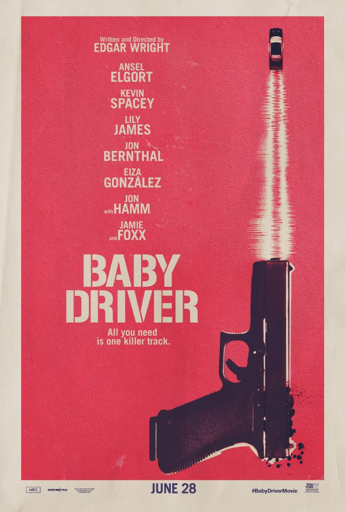

Braeden's Favorite Films
========================

As a cinephile, I can be very particular about my movies. Sometimes I need something that requires some serious
thought into what I've just seen and other times I just want something mindless and funny. Below are a few of my
favorite films over a variety of genres that I hope you will also enjoy!

See our Selection below:

+-------------------+------------+----------+-----------+---------+
| Film Title        | Year       | MPAA     | Run Time  | HAAB    |
|                   | Released   | Rating   |           | Review  |
+===================+============+==========+===========+=========+
| :ref:`BabyDriver` | 2017       | R        | 1hr 52min | 8/10    |
+-------------------+------------+----------+-----------+---------+
| :ref:`CAWS`       | 2014       | PG-13    | 2hr 16min | 9/10    |
+-------------------+------------+----------+-----------+---------+
| :ref:`OtherGuys`  | 2010       | PG-13    | 1hr 56min | 8/10    |
+-------------------+------------+----------+-----------+---------+
| :ref:`12AngryMen` | 1957       | NR       | 1hr 36min | 9/10    |
+-------------------+------------+----------+-----------+---------+

.. _BabyDriver:

Baby Driver
-----------

Description:
~~~~~~~~~~~~

When talented driver, Baby (Ansel Elgort), is forced into a string of robberies as the getaway driver, music becomes 
both his inspiration for his fanatic driving, as well as, his only escape from the shady life he leads. That is until 
he meets Debora (Lily James), a simple sweet waitress that could be the very key to convincing Baby to finally leave 
his old road behind. 

**Starring:** Ansel Elgort, Kevin Spacey, Lily James, Lily James, Jon Bernthal, Eliza Gonzalez, John Hamm, and Jamie Foxx.

**Directed by:** Edgar Wright

**Run Time:** 1hr 52min

**MPAA Rating:** Rated R; Violence & Adult Language throughout

**HAAB Review:** Baby driver is an intense adventure of cars, heists, love, and music. In terms of action sequencing, 
the scenes with Baby maneuvering in and out of heavy traffic in spectacular driving stunts are a wonder to behold and 
thrilling through every bend and turn. The acting, for the most part, is immaculate. John Hamm delivers a chest 
tightening performance in the film's second act which more than makes up for Ansel Elgort's wavering southern accent. 
Elgort does, however, create a fleshed out Baby that is very human in his flaws though admirable in character. 
If you need one single reason to see this film then look no further than the soundtrack. The score is comprised of 
classic tunes and incredible remixes that make the film simply fun to listen to. The opening sequence of the film 
combines this energetic score with artistic cinematography that everyone should have the chance to see! 

Check out the trailer for `Baby Driver`_!

.. _Baby Driver: https://www.youtube.com/watch?v=z2z857RSfhk

**If you like Baby Driver you may also like:**

* *Guardians of the Galaxy*
* *Scott Pilgrim vs. The World*
* *Atomic Blonde*

.. _CAWS:

Captain America: The Winter Soldier
-----------------------------------
.. image:: images/captain_america_winter_soldier.jpg
    :width: 50%

Description:
~~~~~~~~~~~~

Steve Rogers (Chris Evans), or better known as Captain America, has been an active operative for S.H.I.E.L.D for 
several years now having lead counter-terrorist Strike teams against threats to the American homeland.  But as Steve 
begins to question possible hidden agendas coming from command, a ghost from his past arrives in the form of The 
Winter Soldier, a Hydra Assassin. With Steve's questioning of orders and a mission set up to fail, Captain America 
must go rogue battle both friend and foe as a conspiracy unfolds.

**Starring:** Chris Evans, Samuel L. Jackson, Scarlett Johansson

**Directed by:** Anthony & Joe Russo

**Run Time:** 2hr 16min

**MPAA Rating:** Rated PG-13; Violence, Gunplay, & Action throughout

**HAAB Review:** Marvel has, at the time of this review, 17 films in its collective universe. Though each of these 
films have been very good both in their content and at the box office, Winter Soldier is a gem among the entire 
universe. The film brings the same incredible action, acting, and story as your standard Marvel film, but where Winter
Soldier stands apart is that it stands as a turning point for Marvel's storytelling. Up until this film each movie has
simply been a fun action flick about our heros, but Winter Soldier breaks form by bringing social and political issues
to the silver screen and ask their audiences to think about our own world. !!SPOILER ALERT!! The political issue 
discussed in the film is the debate of security vs privacy. In the MCEU the United States has approved the creation 
of a project to monitor citizens and by using an algorithm can detect terrorist or enemies of the state before they 
can strike. This is not unlike the Patriot Act's approval of NSA monitoring over internet activity and cellular calls
made by Americans. Regardless on your stance of this issue the film does an excellent job at portraying the potential
issues with sacrificing our privacy for "enhanced security." If you see no other Marvel film, which would be a mistake
in itself, then make sure you see Captain America: The Winter Soldier.

Check out the trailer for `Captain America The Winter Soldier`_!

.. _Captain America The Winter Soldier: https://www.youtube.com/watch?v=7SlILk2WMTI

**If you like Captain America: The Winter Soldier you may also like:**

* *Marvel's The Avengers*
* *Captain America: Civil War*
* *Valkyrie*

.. _OtherGuys:

The Other Guys
--------------

Description:
~~~~~~~~~~~~

Terry Hoitz (Mark Wahlberg), a gritty NYC Detective hungry for a real case that makes a difference. Allen Gamble (Will
Ferrell), a timid, by-the-books detective, is simply content filing his paperwork and taking care of the minor cases 
that other detectives don't regularly concern themselves with. These two misfits are partnered together as the 
underdog pair in hopes to replace the shoes of the recently deceased head detectives. 

**Starring:** Will Ferrell, Mark Wahlberg

**Directed by:** Adam McKay

**Run Time:** 1hr 47min

**MPAA Rating:** Rated PG-13; Crude & Sexual Content, Adult language, Violence, & some Drug Material

**HAAB Review:** Will Ferrell comedies are always a good time, especially if you enjoy ridiculous situational humor. 
The Other Guys is chock full of great quotes that will have you making references with you and your friends for 
years. The banter and chemistry between Ferrell and Wahlberg is fantastic as they feed off each other with hilarious 
results. Likely why these two have ventured off and done more comedies together after The Other Guys. What makes this 
film even more incredible is the star-studded cast outside of our main characters. Also feature in the film is Samuel 
L. Jackson, Dwayne Johnson, Michael Keaton, and even Derek Jeter (Yes, the Yankees Shortstop). If you have a night in 
with friends or looking for just a movie that will have you howling, then the Other Guys is an excellent choice. 

Check out the trailer for `The Other Guys`_!

.. _The Other Guys: https://www.youtube.com/watch?v=D6WOoUG1eNo

**If you like The Other Guys you may also like:**

* *Anchorman*
* *Daddy's Home*
* *Step-Brothers*

.. _12AngryMen:

12 Angry Men
------------

Description:
~~~~~~~~~~~~

In the case of a murder trial, the 12 men that form the jury enter their deliberations with their decision made, 
except for one individual who has doubts. A guilty verdict will carry a death sentence for the accused but acquitting 
him could be letting a murder back into the world. With the weight of their decision, the frustration of their free 
time lost to the trial, and the thick summer heat, these men are at each other's throats as they argue back to 
determine the future of a young man on trial.

**Starring:** Henry Fonda, Lee J. Cobb, Martin Balsam

**Directed by:** Sidney Lumet

**Run Time:** 1hr 36min

**MPAA Rating:** No Rating; predates MPAA rating System.

**HAAB Review:** Based off the play of the same name, 12 Angry men is a fantastic view into the proceedings of jury 
deliberations and the character of strong willed men. Though you will find no visual special effects, impressive 
costumes, or extravagant sets, the acting makes the film stand head and shoulders above even modern day films. Henry 
Fonda plays Juror #8, the lone juror that has doubts, and expresses his opinions as he is berated and attacked by his 
fellow jurors that slowly begin to have doubts of their own. I won't spoil the ending here but it is an incredible 
display of human nature and the importance of our jury system in the American Justice System.

Check out the trailer for `12 Angry Men`_!

.. _12 Angry Men: https://www.youtube.com/watch?v=A7CBKT0PWFA

**If you like 12 Angry men you may also like:**

* *Citizen Kane*
* *Once Upon a Time in the West*
* *Psycho*
