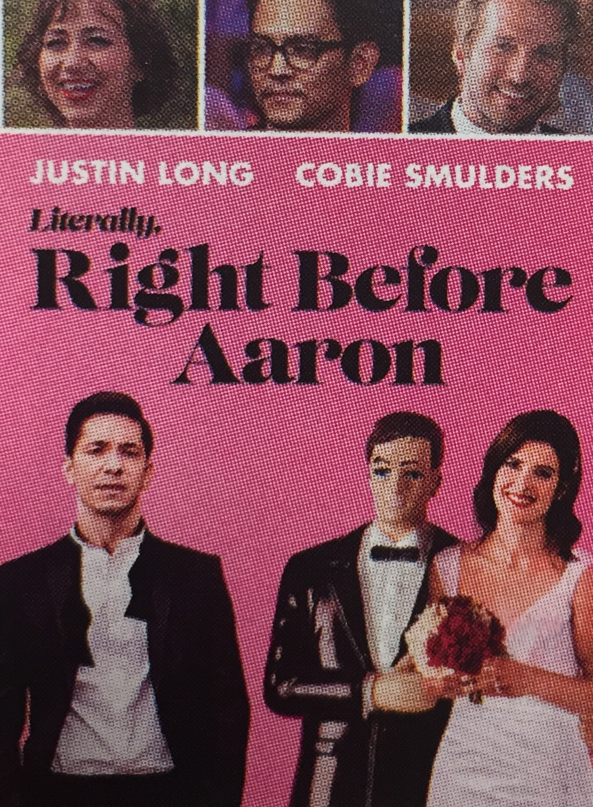
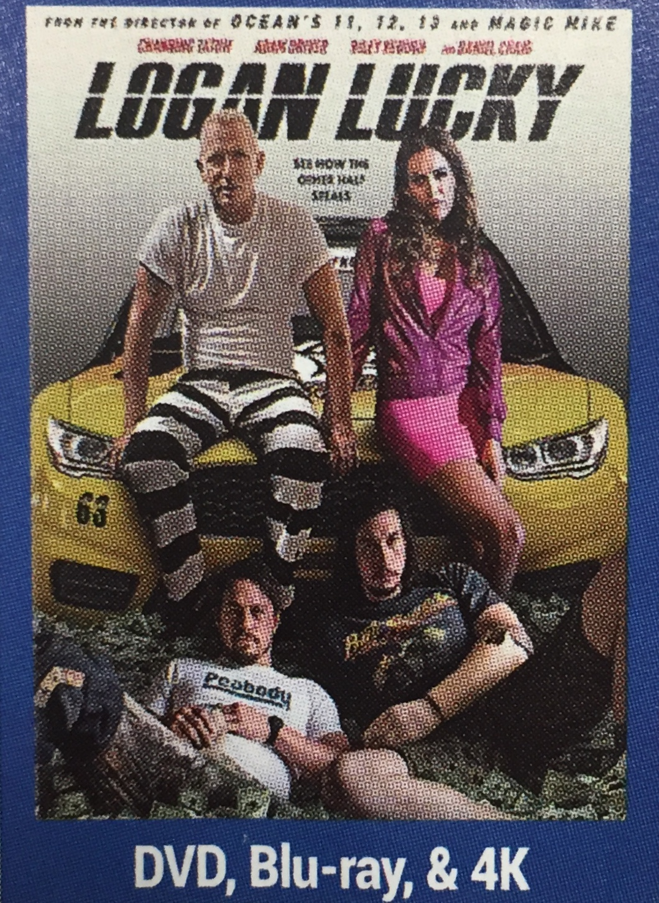

Comedies
========

Welcome to the comedies page! Here is a list of a few of the top comedy movies of all time.

* Monty Python and the Holy Grail
* Airplane!
* Blazing Saddles
* Caddyshack
* Dumb and Dumber 

HAAB's top 4 comedy movies of 2017: 

+-------------------+------------+----------+-----------+---------+
| Film Title        | Year       | MPAA     | Run Time  | HAAB    |
|                   | Released   | Rating   |           | Review  |
+===================+============+==========+===========+=========+
| :ref:`Crashpad`   | 2017       | R        | 2hr 2min  | 5/10    |
+-------------------+------------+----------+-----------+---------+
| :ref:`Desp`       | 2017       | PG       | 1hr 36min | 9/10    |
+-------------------+------------+----------+-----------+---------+
| :ref:`aaron`      | 2017       | PG-13    | 1hr 45min | 6/10    |
+-------------------+------------+----------+-----------+---------+
| :ref:`Logan`      | 2017       | R        | 2hr 2min  | 5/10    |
+-------------------+------------+----------+-----------+---------+

.. _Crashpad:

Crash Pad
---------

.. image:: images/crash.jpg
    :width: 50%

*Description:*
~~~~~~~~~~~~~~
In Crash Pad, a younger man thinks that he is in love with an older woman. 
They had a romantic relationship but to his surprise, the older woman is married!
She was only romantic with him to get revenge on her husband. The husband decides that the
best way for him to get over his cheating wife is to cut her out of his life and move in with 
her young lover! These two men are living it up as newly found bachelors. 

**Starring:** Christina Applegate, Domhnall Gleeson, Nina Dobrev, 
Thomas Church, and Anja Savcic. 

**Run Time:** 1hr 33min

**MPAA Rating:** Rated R

    Check out the trailer for `Crash Pad`_ !

.. _Crash Pad: https://www.youtube.com/watch?v=HfLuNqpK7yg

.. _desp:

Despicable Me 3
---------------

.. image:: images/despicable.jpg
    :width: 50%

*Description:*
~~~~~~~~~~~~~~
In Despicable Me 3, Gru is fired from the Anti-Villain League for not taking down the most recent bad guy.
Gru is very sad and upset until he meets a stranger who tells him that he has a long-lost twin brother
who wants to follow in Gru's footsteps and become a super villain. Gru and his brother team up to steal the 
largest diamond in the world. 

**Starring:** Miranda Cosgrove, Steve Carell, Kristen Wiig, Jenny Slate, and 
Julie Andrews. 

**Run Time:** 1hr 36min

**MPAA Rating:** Rated PG

    Check out the trailer for `Despicable Me 3`_ !

.. _Despicable Me 3: https://www.youtube.com/watch?v=euz-KBBfAAo

.. _aaron:

Literally, Right Before Aaron
-----------------------------

*Description:*
~~~~~~~~~~~~~~

Adam has just broken up with his girlfriend and he is devastated when he finds
out that his ex is engaged. To make things even worse, he gets invited to the wedding. Adam
still has feelings for his ex but at the wedding, he has to try and convince everyone that he 
doesn't have feelings for her anymore. When he is home, he discovers the hard truth of love 
and life. 

**Starring:** Cobie Smulders, Justin Long, Dana Delany, Kristen Schaal, and Ryan Hansen. 

**Run Time:** 1hr 36min

**MPAA Rating:** Rated PG
    Check out the trailer for `Literally Right Before Aaron`_ !

.. _Literally Right Before Aaron: https://www.youtube.com/watch?v=ruJWLgLiSX0

.. _logan:

Logan Lucky
-----------

*Description:*
~~~~~~~~~~~~~~
 
In Logan Lucky, Jimmy got fired from his job and convinces his brother and sister
to help him rob the Charlotte Motor Speedway during a NASCAR race. To do this, they need
help from one of their friends who is in prison. The Logan family always seems to have
things go wrong so this will definitely be an adventure. 

**Starring:** Daniel Craig, Channing Tatum, Adam Driver, Riley Keough, and Seth MacFarlane.

**Run Time:** 1hr 59min

**MPAA Rating:** Rated PG- 13

    Check out the trailer for `Logan Lucky`_ !

.. _Logan Lucky: https://www.youtube.com/watch?v=ruJWLgLiSX0