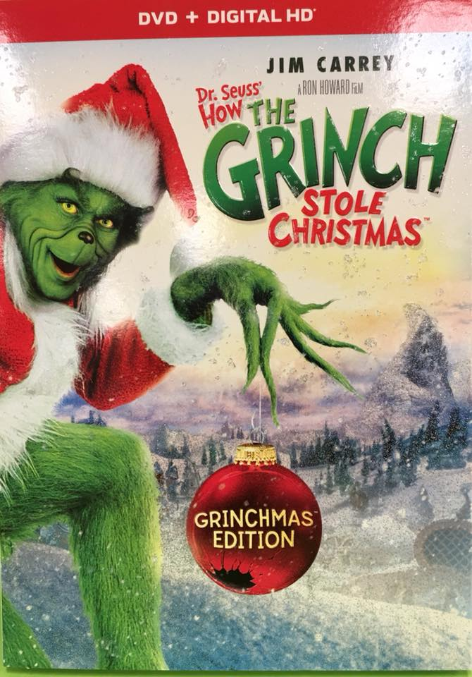
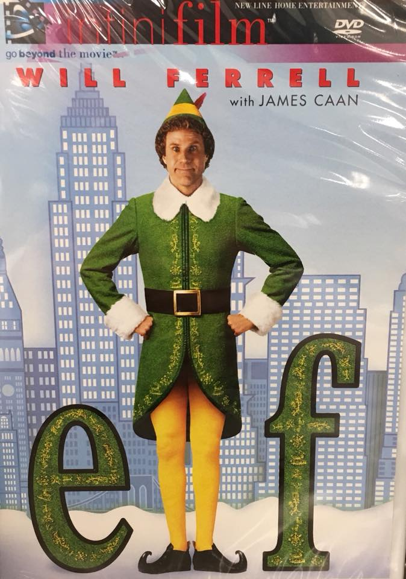

Holiday Films
=============

Are you looking for some cozy holiday movies to watch with the family? Look no
further, HAAB's got you covered!

See our selection below:

+---------------------------------+------------+----------+-----------+---------+
| Film Title                      | Year       | MPAA     | Run Time  | HAAB    |
|                                 | Released   | Rating   |           | Review  |
+=================================+============+==========+===========+=========+
| :ref:`Grinch`                   | 2000       | PG       | 1hr 45min | 8/10    |
+---------------------------------+------------+----------+-----------+---------+
| :ref:`Nightmare`                | 1993       | PG       | 1hr 16min | 8/10    |
+---------------------------------+------------+----------+-----------+---------+
| :ref:`elff`                     | 2003       | PG       | 1hr 37min | 7/10    |
+---------------------------------+------------+----------+-----------+---------+

.. _Grinch:

How The Grinch Stole Christmas
------------------------------

Description:
~~~~~~~~~~~~
This is the live action version of Dr. Seuss' How The Grinch Stole Christmas.
The Grinch is a solitary man who resides outside of Whoville, and the Whos know
better than to bother or even step foot near his cliff. For the Grinch is a very
scary and heartless person. But little Cindy Lou Who wants to find the reason 
why he avoids all the Whos but even more so, why he hates Christmas.

**Starring:** *Jim Carrey, Taylor Momsen, Jeffrey Tambor, Christine Baranski, 
Bill Irwin, and Molly Shannon.*

**Directed by:** *Ron Howard*

**Run Time:** 1hr 45min

**MPAA Rating:** Rated PG; Crude humor.

Check out the trailer for `How The Grinch Stole Christmas`_

.. _How The Grinch Stole Christmas: https://www.youtube.com/watch?v=myTaigPrbsg

**If you like How The Grinch Stole Christmas, you may also like:**

* A Christmas Carole
* The Santa Clause
* Rise of the Guardians

.. _Nightmare:

The Nightmare Before Christmas
------------------------------

Description:
~~~~~~~~~~~~
The pumpkin king of Halloween Town, Jack Skellington, is bored of always doing 
the same thing every year and day for Halloween. When Halloween ends then it's 
the task of preparing for Halloween. Jack is bored, he wants to do something 
different, something Halloween Town and himself has never seen before. Then one 
day he discovers Christmas, and that is where the real adventure and mishaps 
come about.

**Starring:** *Danny Elfman, Chris Sarandon, and Catherine O'Hara.*

**Directed by:** *Tim Burton*

**Run Time:** 1hr 16min

**MPAA Rating:** Rated PG; for some scary images.

Check out the trailer for `The Nightmare Before Christmas`_

.. _The Nightmare Before Christmas: https://www.youtube.com/watch?v=wr6N_hZyBCk

**If you like The Nightmare Before Christmas, you may also like:**

* Corpse Bride
* Coraline
* Frankenweenie

.. _elff:

elf
---

Description:
~~~~~~~~~~~~
Santa's workshop has a very large elf that is causing a lot of mishaps and havoc
to all the other elfs in the North Pole. Buddy is his name and the North Pole
is the only life he has ever known, given that he was raised there. Buddy is 
then sent to NYC by Santa to find his birth father. 

**Starring:** *Will Ferrell, James Caan, Bob Newhart, Edward Asner, and Zooey 
Deschanel.*

**Directed by:** *Jon Favreau*

**Run Time:** 1hr 37min

**MPAA Rating:** Rated PG; Mild rude humor and language.

Check out the trailer for `elf`_

.. _elf: https://www.youtube.com/watch?v=gW9wRNqQ_P8

**If you like elf, you may also like:**

* Home Alone Series
* Christmas with the Kranks
* A Christmas Story
