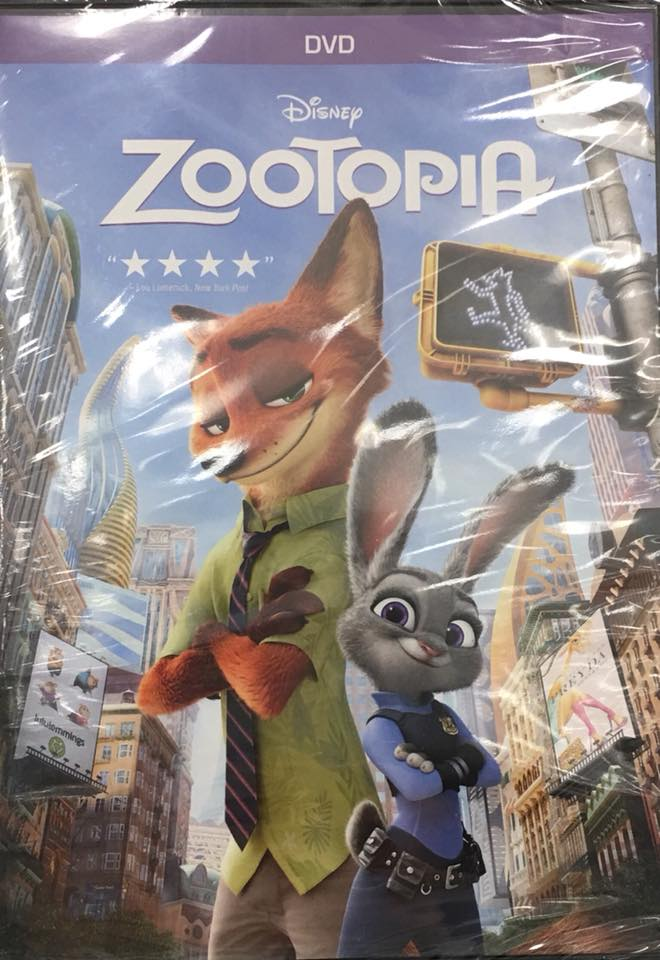
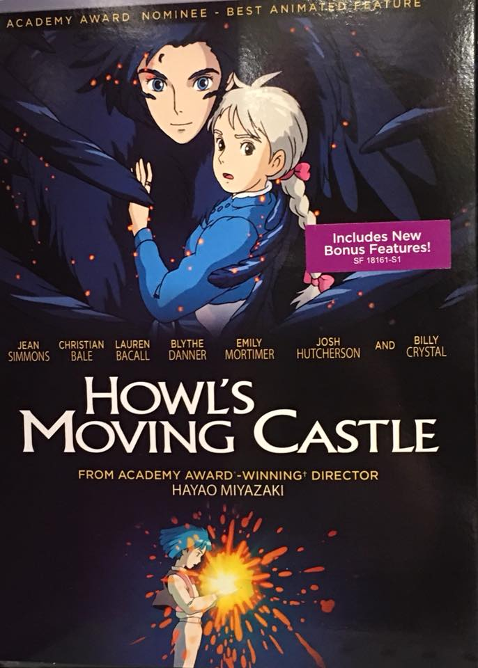
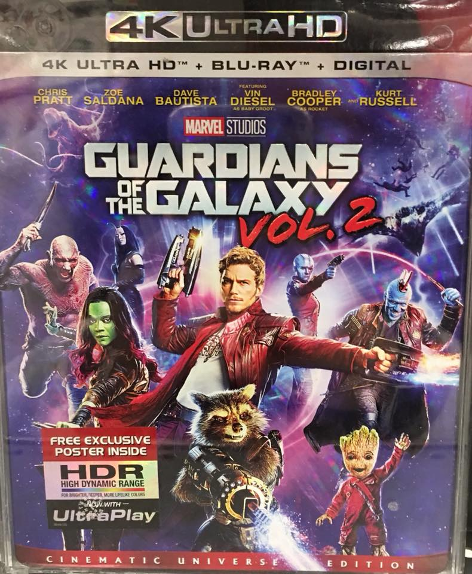

Holly's Favorites
=================

Are you looking for new movies to watch? Maybe you want to try a new genre?
Listed below are some of Holly's favorite movies. Why not give a watch?

See her selection below:

+-------------------+------------+----------+-----------+---------+
| Film Title        | Year       | MPAA     | Run Time  | HAAB    |
|                   | Released   | Rating   |           | Review  |
+===================+============+==========+===========+=========+
| :ref:`zoo`        | 2016       | PG       | 1hr 48min | 9/10    |
+-------------------+------------+----------+-----------+---------+
| :ref:`howl`       | 2004       | PG       | 1hr 59min | 9/10    |
+-------------------+------------+----------+-----------+---------+
| :ref:`guardians`  | 2017       | PG-13    | 2hr 16min | 8/10    |
+-------------------+------------+----------+-----------+---------+

.. _zoo:

Zootopia 
--------

Description:
~~~~~~~~~~~~

Zootopia, the metropolis where any animal, no matter big or small can achieve
their dreams. But things might not seem so easy for Judy Hopps (a bunny), when
she gets placed into situations she has never encountered before, coming from a
smaller community herself. Things get pretty wild for the little bunny when she
teams up with a cynical fox to solve the biggest mystery in all of Zootopia.

**Starring:** *Ginnifer Goodwin, Jason Bateman, Idris Elba, and Tommy Chong.*

**Directed by:** *Byron Howard*

**Run Time:** 1hr 48min

**MPAA Rating:** Rated PG; Thematic elements, rude humor, and action.

**HAAB Review:** I thoroughly enjoyed this movie! It's not only cute but it has
such an inspirational message that I really like. Maybe it's the inner kid in
me, but Pixar and Disney never disappoints when it comes to their animated
films. I love all the detail that they put into this film, from the different
habitats to the various animals and even the smallest detail (that Mickey Mouse
head on the wall!). Judy Hopps and Nick Wilde make such a great duo and the 
running gags in it are just a joy. You definitely won't be disappointed in 
watching this kids' movie!

Check out the trailer for `Zootopia`_

.. _Zootopia: https://www.youtube.com/watch?v=jWM0ct-OLsM

**If you like Zootopia you may also like:**

* Big Hero 6
* Wreck it Ralph
* Moana

.. _howl:

Howl's Moving Castle
--------------------

Description:
~~~~~~~~~~~~

Sophie, an 18 year old hat maker, has always been very introverted and very old 
lady like. One day she encounters the rumored lady killer, Howl. The Wicked 
Witch of the Waste caught her encounter with Howl and thus, casts a spell on
Sophie, turning her into an old woman. The spell also prevents her from talking
about it. Sophie then goes on a journey in hopes of breaking the spell, but
along the way she meets new friends, forms a friendship with Howl, and gradually
becomes more lively as she is thrown in a world she's never known.

**Starring:** *Christian Bale, Jean Simmons, Lauren Bacall, Blythe Danner, and 
Emily Mortimer.*

**Directed by:** *Hayao Miyazaki*

**Run Time:** 1hr 59min

**MPAA Rating:** Rated PG; Frightening images and mild language.

**HAAB Review:** I love Studio Ghibli movies in general, but this is one of my
top favorites. If you have never seen any movies from this company, I highly
recommend that you do. There are so many classics as well as some new releases
that are a joy to watch. Even if you are not a fan of animated films in general,
I believe that many of the films that Studio Ghibli produce are well worth 
watching. This movie has a nice balance of fantasy, adventure and romance. 
I love it. Everything about it is very whimsical to me. I would also like to 
mention that Joe Hisaishi composes the soundtrack to this movie and it is 
absolutely beautiful. Studio Ghibli really knows how to pair their films with 
music, everything that goes into it is absolutely magical.

Check out the trailer for `Howls Moving Castle`_

.. _Howls Moving Castle: https://www.youtube.com/watch?v=iwROgK94zcM

**If you like Howl's Moving Castle you may also like:**

* Spirited Away
* Princess Mononoke
* My Neighbor Totoro

.. _guardians:

Guardians of the Galaxy Vol. 2 
------------------------------

Description:
~~~~~~~~~~~~

The Guardians of the Galaxy are learning how to be a family as they struggle 
with each other's quirks and differences. The story continues where it left off, 
with Peter Quill trying to find out more about where he came from. How will the 
team work together and settle their differences when old foes and betrayal start
to surface?

**Starring:** *Chris Pratt, Zoe Saldana, Dave Bautista, Vin Diesel, Bradley
Cooper, and Michael Rooker.*

**Directed by:** *James Gunn*

**Run Time:** 2hr 16min

**MPAA Rating:** Rated PG-13; Intense sequences of sci-fi violence and
action, and language.

**HAAB Review:** I personally enjoyed the first installment of this series but
the second is probably my favorite of the two. It might have to be because I
think Baby Groot is such a cutie, but I also enjoyed the character development
in this. We get to see more of Quill's parentage and how everyone deals with
each other since the last movie. This movie was such an emotional roller coaster
for me as the story progressed and I like that in a movie. It left me wanting to 
watch more as everything unfolded. I also really liked the selection of music in 
this, very fitting for all the scenes. The non-stop jokes and humor was also 
greatly appreciated.

Check out the trailer for `Guardians of the Galaxy Vol 2`_

.. _Guardians of the Galaxy Vol 2: https://www.youtube.com/watch?v=duGqrYw4usE

**If you like Guardians of the Galaxy Vol 2 you may also like:**

* Guardians of the Galaxy 
* Doctor Strange
* Wonder Woman
