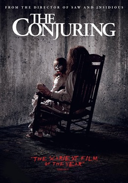
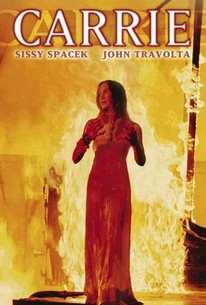

Horror Films
============

Looking for a film that'll give you nightmares for a week? Maybe you're feeling
spooky. Look no further, HAAB's got you covered!

See our Selection below:

+-------------------------------------+------------+----------+-----------+---------+
| Film Title                          | Year       | MPAA     | Run Time  | HAAB    |
|                                     | Released   | Rating   |           | Review  |
+=====================================+============+==========+===========+=========+
| IT                                  | 1990       | TV-14    | 3hr 12min | 7/10    |
+-------------------------------------+------------+----------+-----------+---------+
| The Conjuring                       | 2013       | R        | 1hr 52min | 8/10    |
+-------------------------------------+------------+----------+-----------+---------+
| Carrie                              | 1976       | R        | 1hr 38min | 8/10    |
+-------------------------------------+------------+----------+-----------+---------+

IT (1990)
------------------
.. image:: it.jpg
    :width: 50%

Description:
~~~~~~~~~~~~

It's 1960, seven pre-teen outcasts have to fight an evil-demon who is pretending to
be a clown, killing children. They return thirty years later to stop this evil creature
once and for all when it returns to their hometown.

**Starring:** Richard Thomas, Tim Reid, and Annette O'Toole 

**Directed by:** Tommy Lee Wallace

**Run Time:** 3hr 12min

**MPAA Rating:** Rated R, Violence & Adult Language throughout

Check out the trailer for `IT`_ !

.. _IT: https://www.youtube.com/watch?v=k10ETZ41q5o

**If you like IT you may also like:**

* IT (2017)
* The Shining
* Creepers Jeepers

The Conjuring (2013)
------------------

Description:
~~~~~~~~~~~~

It's 1970, paranomal investigators and demonologists Lorrain (Vera Farmiga)
and Ed (Patrick Wilson) Warren are called to the home of the Perron Family. The 
Perrons and their daughters have recently moved into a secluded farmhouse where
paranormal occurrences have taken place. The Warrens soon discover the house's
grim history. 

**Starring:** Vera Farmiga, Patrick Wilson, Lili Taylor, and Ron Livingston.

**Directed by:** James Wan

**Producer:** New Line Cinema and Warner Brothers Studios

**Run Time:** 1hr 52min

**MPAA Rating:** Rated R, Violence & Adult Language throughout

Check out the trailer for `The Conjuring`_ !

.. _The Conjuring: https://www.youtube.com/watch?v=k10ETZ41q5o

**If you like Baby Driver you may also like:**

* The Conjuring 2
* Annabelle
* Insidious

Carrie (1976)
------------------

Description:
~~~~~~~~~~~~

Carrie White (Sissy Spacek), a shy and friendless high school girl has grown up 
being sheltered by her abusive, religious and domineering mother. One day she
unleashes telekinetic powers after an humiliating incident at her high school prom.

**Starring:** Sissy Spacek, Piper Laurie, and Amy Irving.

**Directed by:** Brian De Palma

**Run Time:** 1hr 38min

**MPAA Rating:** Rated R, Violence & Adult Language throughout

Check out the trailer for `Carrie`_ !

.. _Carrie: https://www.youtube.com/watch?v=YuO26oJQLVs

**If you like Carrie you may also like:**

* Scream
* Poltergeist
* The Exorcist