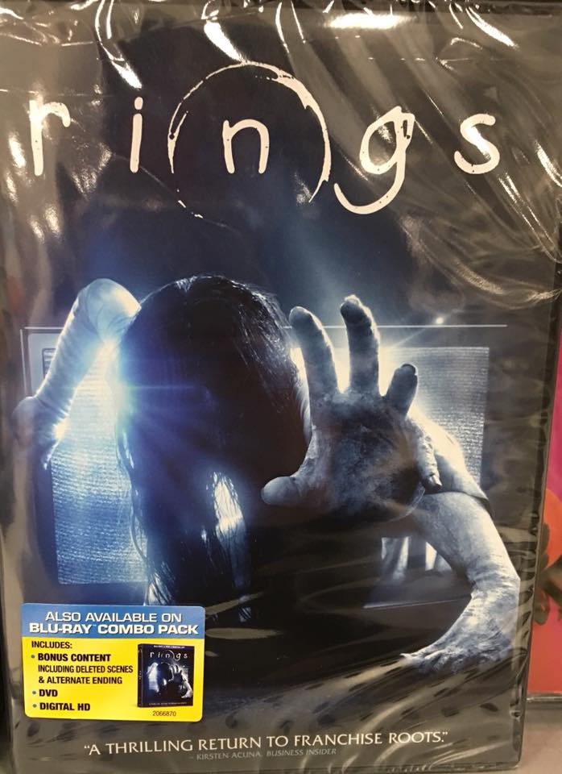

Horror Films
============

Looking for a film that'll give you nightmares for a week? Maybe you're feeling
spooky. Look no further, HAAB's got you covered!

See our selection below:

+-------------------------+------------+----------+-----------+---------+
| Film Title              | Year       | MPAA     | Run Time  | HAAB    |
|                         | Released   | Rating   |           | Review  |
+=========================+============+==========+===========+=========+
| :ref:`getout`           | 2017       | R        | 1hr 44min | 8/10    |
+-------------------------+------------+----------+-----------+---------+
| :ref:`alien`            | 2017       | R        | 2hr 2min  | 7/10    |
+-------------------------+------------+----------+-----------+---------+
| :ref:`ring`             | 2017       | PG-13    | 1hr 42min | 5/10    |
+-------------------------+------------+----------+-----------+---------+

.. _getout:

Get Out 
-------

Description:
~~~~~~~~~~~~

Chris and his girlfriend Rose, have reached the point in their relationship
where she is able to introduce him to her parents. What seemed like a quirky
family gradually turns for the worse. This leads Chris to discovering the 
family's dark secrets and their dark intentions for him. 

**Starring:** *Daniel Kaluuya, Allison Williams, Catherine Keener, and Bradley 
Whitford.*

**Directed by:** *Jordan Peele*

**Run Time:** 1hr 44min

**MPAA Rating:** Rated R; Violence, bloody images, language, and sexual 
references.

Check out the trailer for `Get Out`_

.. _Get Out: https://www.youtube.com/watch?v=sRfnevzM9kQ

**If you like Get Out you may also like:**

* Don't Breathe
* It (2017)
* Split

.. _alien:

Alien: Covenant
---------------

Description:
~~~~~~~~~~~~

A colony ship of more than 2,000 set out on an expedition to a remote planet, 
but things go wrong once they discover this uncharted land. The humans are faced
with monsters they have never seen before and this expedition trip ends up being
a rescue mission as they try to escape the terrifying unkown.

**Starring:** *Michael Fassbender, Katherine Waterston, Billy Crudup, and Danny 
McBride.*

**Directed by:** *Ridley Scott*

**Run Time:** 2hr 2min

**MPAA Rating:** Rated R, Sci-fi violence, bloody images, language, and 
sexuality/nudity.

Check out the trailer for `Alien Covenant`_

.. _Alien Covenant: https://www.youtube.com/watch?v=svnAD0TApb8

**If you like Alien: Covenant you may also like:**

* Prometheus
* Alien Series
* Kong: Skull Island

.. _ring:

Rings
-----

Description:
~~~~~~~~~~~~

There is an urban legend that talks about a mysterious video that is said to
kill the person who watches the video in seven days. Julia soon becomes worried
for her boyfriend, Holt, after he finds said video. But through this they 
discover that the movie has a movie within it.

**Starring:** *Matilda Anna Ingrid Lutz, Alex Roe, Johnny Galecki, Vincent 
D'Onofrio, and Aimee Teegarden.*

**Directed by:** *F. Javier Gutierrez*

**Run Time:** 1hr 42min

**MPAA Rating:** Rated PG-13; Violence, terror, thematic elements, sexuality,
and brief drug material. 

Check out the trailer for `Rings`_

.. _Rings: https://www.youtube.com/watch?v=YuO26oJQLVs

**If you like Rings you may also like:**

* Ring Series
* The Bye Bye Man
* Ouija
