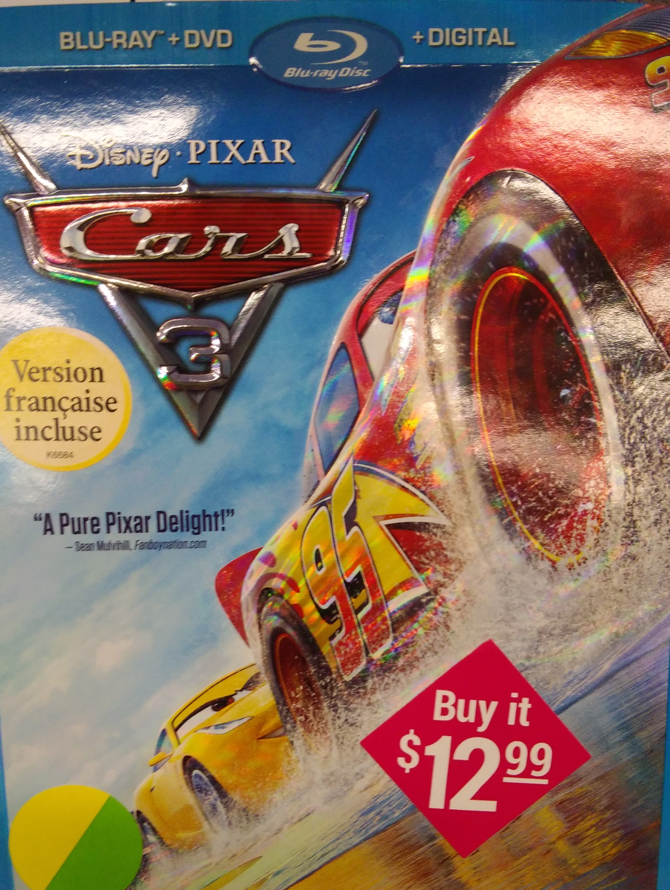
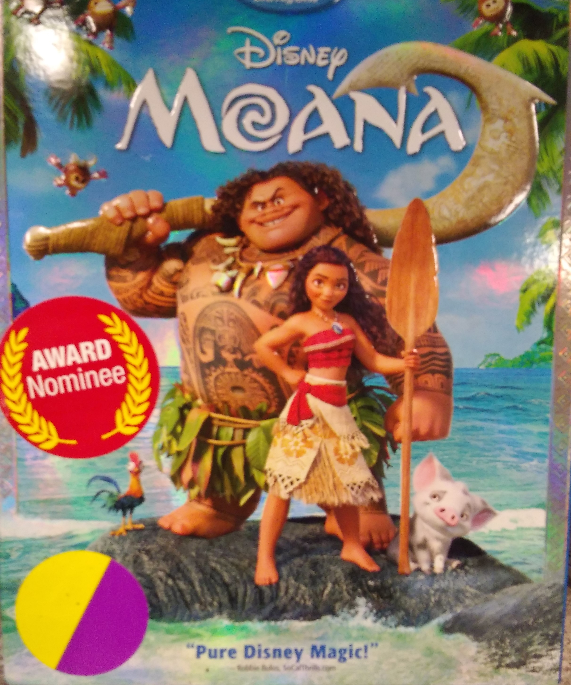
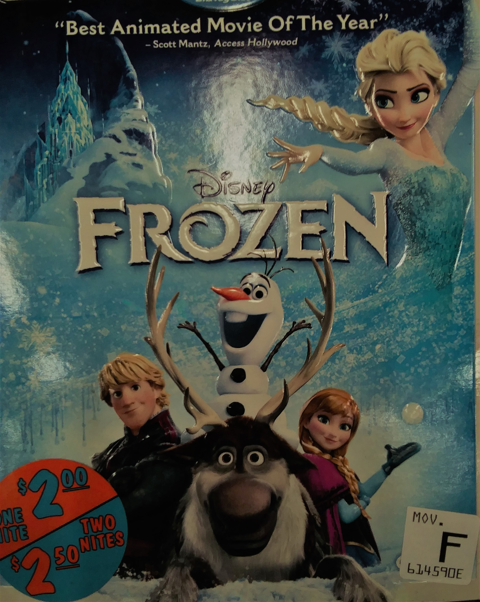

**Kids Films**
==============

See our Selection below:

+-------------------+------------+----------+-----------+---------+
| Film Title        | Year       | MPAA     | Run Time  | HAAB    |
|                   | Released   | Rating   |           | Review  |
+===================+============+==========+===========+=========+
| :ref:`Cars3`      | 2017       | G        | 1hr 49min | 7/10    |
+-------------------+------------+----------+-----------+---------+
| :ref:`Mo`         | 2016       | PG       | 1hr 43min | 9/10    |
+-------------------+------------+----------+-----------+---------+
| :ref:`Froz`       | 2013       | PG       | 1hr 42min | 8/10    |
+-------------------+------------+----------+-----------+---------+

.. _Cars3:

Cars 3 
------

*Description:*
~~~~~~~~~~~~~~

Blindsided by a new generation of blazing-fast racers, the legendary 
Lightning McQueen (voice of Owen Wilson) is suddenly pushed out of the 
sport he loves. To get back in the game, he will need the help of an eager 
young race technician, Cruz Ramirez (voice of Cristela Alonzo), with her
own plan to win, plus inspiration from the late Fabulous Hudson Hornet and 
a few unexpected turns. Proving that #95 isn't through yet will test the 
heart of a champion on Piston Cup Racing's biggest stage!.

**Starring:** Owen Wilson, Cristela Alonzo, Kerry Washington, 
Nathan Fillion, Lea DeLaria, Armie Hammer, Bonnie Hunt.

**Run Time:** 1hr 49min

**MPAA Rating:** Rated G

Check out the trailer for `Cars 3`_ !

.. _Cars 3: https://www.youtube.com/watch?v=2LeOH9AGJQM

**If you like Cars 3 you may also like:**

* Coco
* Finding Nemo
* Toy Story

.. _Mo:

Moana
-----

*Description:*
~~~~~~~~~~~~~~

Three thousand years ago, the greatest sailors in the world voyaged across
the vast Pacific, discovering the many islands of Oceania. But then, for a
millennium, their voyages stopped - and no one knows exactly why. From Walt
Disney Animation Studios comes "Moana," a sweeping, CG-animated feature 
film about an adventurous teenager who sails out on a daring mission to 
save her people. During her journey, Moana (voice of Auli'i Cravalho) meets
the mighty demigod Maui (voice of Dwayne Johnson), who guides her in her
quest to become a master wayfinder. Together, they sail across the open 
ocean on an action-packed voyage, encountering enormous monsters and
impossible odds, and along the way, Moana fulfills the ancient quest of   
her ancestors and discovers the one thing she's always sought: her own 
identity..

**Starring:** Dwayne Johnson, Auli'i Cravalho, Jemaine Clement, 
Nichole Scherzinger, Temuera Morrison, Racheal House.

**Run Time:** 1hr 43min

**MPAA Rating:** Rated PG

Check out the trailer for `Moana`_ !

.. _Moana: https://www.youtube.com/watch?v=LKFuXETZUsI

**If you like Moana you may also like:**

* Frozen
* Zootopia
* Mulan

.. _Froz:

Frozen
------

*Description:*
~~~~~~~~~~~~~~

Featuring the voices of Kristen Bell and Idina Menzel, "Frozen" is the 
coolest comedy-adventure ever to hit the big screen. When a prophecy traps
a kingdom in eternal winter, Anna, a fearless optimist, teams up with
extreme mountain man Kristoff and his sidekick reindeer Sven on an epic
journey to find Anna's sister Elsa, the Snow Queen, and put an end to her
icy spell. Encountering mystical trolls, a funny snowman named Olaf,
Everest-like extremes and magic at every turn, Anna and Kristoff battle the
elements in a race to save the kingdom from destruction. (c) Disney.

**Starring:** Kristen Bell, Idina Menzel, Jonathan Groff, Josh Gad, 
Santino Fontana, Alan Tudyk.

**Run Time:** 1hr 42min

**MPAA Rating:** Rated PG

Check out the trailer for `Frozen`_ !

.. _Frozen: https://www.youtube.com/watch?v=TbQm5doF_Uc

**If you like Frozen, you may also like:**

* Big Hero 6
* Rise of the Guardians
* Tangled
