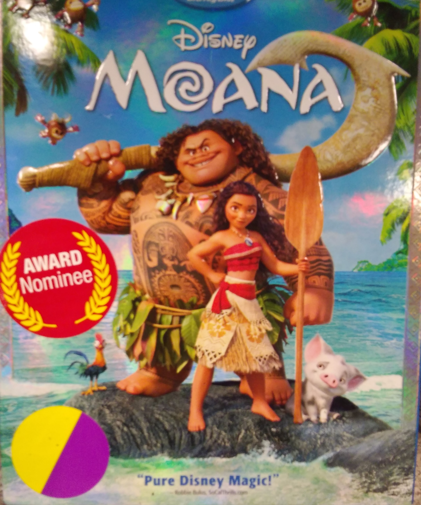

Kids' Films
===========

Looking for a film that will make your kids laugh and give you a
much-needed break?  HAAB has a great selection of movies that will
captivate all ages!

See our selection below:

+-------------------+------------+----------+-----------+---------+
| Film Title        | Year       | MPAA     | Run Time  | HAAB    |
|                   | Released   | Rating   |           | Review  |
+===================+============+==========+===========+=========+
| :ref:`Cars3`      | 2017       | G        | 1hr 49min | 7/10    |
+-------------------+------------+----------+-----------+---------+
| :ref:`Mo`         | 2016       | PG       | 1hr 43min | 9/10    |
+-------------------+------------+----------+-----------+---------+
| :ref:`Froz`       | 2013       | PG       | 1hr 42min | 8/10    |
+-------------------+------------+----------+-----------+---------+

.. _Cars3:

Cars 3 
------
.. image:: images/cars3.jpg
    :width: 50%

*Description:*
~~~~~~~~~~~~~~

Blindsided by a new generation of blazing-fast racers, the legendary 
Lightning McQueen (voice of Owen Wilson) is suddenly pushed out of the 
sport he loves. To get back in the game, he will need the help of an eager 
young race technician, Cruz Ramirez (voice of Cristela Alonzo), with her
own plan to win, plus inspiration from the late Fabulous Hudson Hornet and 
a few unexpected turns. Proving that #95 isn't through yet will test the 
heart of a champion on Piston Cup Racing's biggest stage! Cited from IMDb

**Starring:** Owen Wilson, Cristela Alonzo, Kerry Washington, 
Nathan Fillion, Lea DeLaria, Armie Hammer, Bonnie Hunt.

**Directed by:**  Brian Fee

**Run Time:** 1hr 49min

**MPAA Rating:** Rated G 

Check out the trailer for `Cars 3`_!

.. _Cars 3: https://www.youtube.com/watch?v=2LeOH9AGJQM

**If you like Cars 3 you may also like:**

* Coco
* Finding Nemo
* Toy Story

.. _Mo:

Moana
-----

*Description:*
~~~~~~~~~~~~~~

Moana Waialiki is a sea voyaging enthusiast and the only daughter of a chief in a
long line of navigators. When her island's fishermen can't catch any fish and the 
crops fail, she learns that the demigod Maui caused the blight by stealing the heart
of the goddess, Te Fiti. The only way to heal the island is to persuade Maui to 
return Te Fiti's heart, so Moana sets off on an epic journey across the Pacific. 
The film is based on stories from Polynesian mythology. Cited from IMDb

**Starring:** Dwayne Johnson, Auli'i Cravalho, Jemaine Clement, 
Nichole Scherzinger, Temuera Morrison, Racheal House.

**Directed by:** Ron Clements, John Musker

**Run Time:** 1hr 43min

**MPAA Rating:** Rated PG for peril, some scary images and brief thematic elements

Check out the trailer for `Moana`_!

.. _Moana: https://www.youtube.com/watch?v=LKFuXETZUsI

**If you like Moana you may also like:**

* Frozen
* Zootopia
* Mulan

.. _Froz:

Frozen
------
.. image:: images/frozen.jpg
    :width: 50%

*Description:*
~~~~~~~~~~~~~~

Featuring the voices of Kristen Bell and Idina Menzel, "Frozen" is the 
coolest comedy-adventure ever to hit the big screen. When a prophecy traps
a kingdom in eternal winter, Anna, a fearless optimist, teams up with
extreme mountain man Kristoff and his sidekick reindeer Sven on an epic
journey to find Anna's sister Elsa, the Snow Queen, and put an end to her
icy spell. Encountering mystical trolls, a funny snowman named Olaf,
Everest-like extremes and magic at every turn, Anna and Kristoff battle the
elements in a race to save the kingdom from destruction. Cited from Rotten Tomatoes.

**Starring:** Kristen Bell, Idina Menzel, Jonathan Groff, Josh Gad, 
Santino Fontana, Alan Tudyk.

**Directed by:**  Chris Buck, Jennifer Lee

**Run Time:** 1hr 42min

**MPAA Rating:** Rated PG for some action and mild rude humor

Check out the trailer for `Frozen`_!

.. _Frozen: https://www.youtube.com/watch?v=TbQm5doF_Uc

**If you like Frozen, you may also like:**

* Big Hero 6
* Rise of the Guardians
* Tangled
