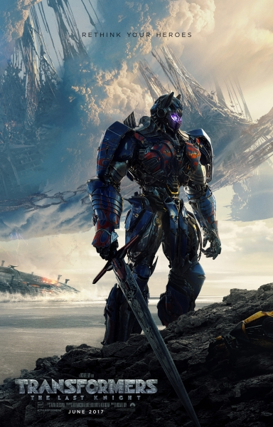

**New Releases**
================

See our Selection below:

+--------------------------------------------------+------------+----------+-----------+---------+
| Film Title                                       | Year       | MPAA     | Run Time  | HAAB    |
|                                                  | Released   | Rating   |           | Review  |
+==================================================+============+==========+===========+=========+
| The House                                        | 2017       | R        | 1hr 25min | 3/10    |
+--------------------------------------------------+------------+----------+-----------+---------+
| Pirates of the Caribbean: Dead Men Tell No Tales | 2017       | PG-13    |  2hr 9min | 5/10    |
+--------------------------------------------------+------------+----------+-----------+---------+
| Transformers: The Last Knight                    | 2017       | PG-13    | 2hr 29min | 2/10    |
+--------------------------------------------------+------------+----------+-----------+---------+

**Transformers (2017)**
-----------------------

*Description:*
~~~~~~~~~~~~~~

The war between the Autobots and the Decpticons rages on though now without the command of the Autobot leader, Optimus Prime. As the secrets of the Transformers long history with earth are revealed, with there still be time to save the earth from total destruction? 

**Starring:** Mark Wahlberg, Anthony Hopkins, Josh Duhamel

**Directed by:** Michael Bay

**Producer:** Paramount Pictures

**Run Time:** 2hr 29min

**MPAA Rating:** Rated PG-13, Violence, Intense Actions, Adult Language, and some Innuendo.

**HAAB Review:** Transformers: The Last Knight, the fifth installment of the Transformers film series by Michael Bay, will hopefully be its last. To call this movie terrible would be unfair though not entirely untrue, however, all this film has to offer is more of the same. As in every Transformers film so far we open with quick refresher to establish the fallout of the previous film and the dynamic between the human race, the Autobots, and the Decepticons. Then insert an overdose of robot juggernaut fights and inexplicable explosions that is then followed by a mysterious secret of the Transformers of either their past or the dubious actions of the Decepticons that will inevitably turn out to be a red herring of their actual plans. These evil plans are thwarted by our heroes, though most notably by Optimus Prime, the original and toy sales team's favorite. And despite the repitious plot over the span of 5 movies, there is still an apparent disregard for story length. The film, seems to try to reinvent itself TWICE during the film which in turn increases the run time exponentially leading to the ridiculous 2 hour and 29 minute run time. What The Last Knight did well was its creation of excting fight sequences that are plan fun action. What the Last Knight did poorly was innovating its storyline, sticking to a single coherrent plot line, and it failed to leave racist caracitures out of the film.

Check out the trailer for `Transformers the Last Knight`_ !

.. _Transformers the Last Knight: https://www.youtube.com/watch?v=6Vtf0MszgP8

**If you like Transformers: The Last Knight you may also like:**

* Pirates of the Caribbean: Dead Men Tell No Tales
* The Mummy
* Spider-man: Homecoming