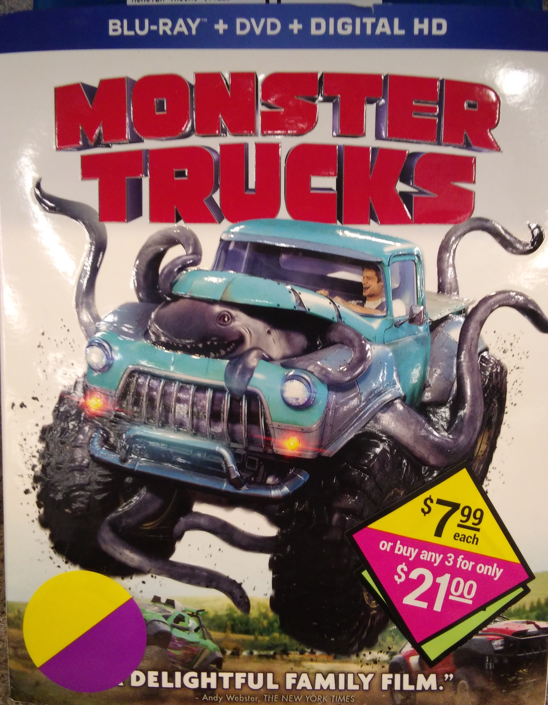
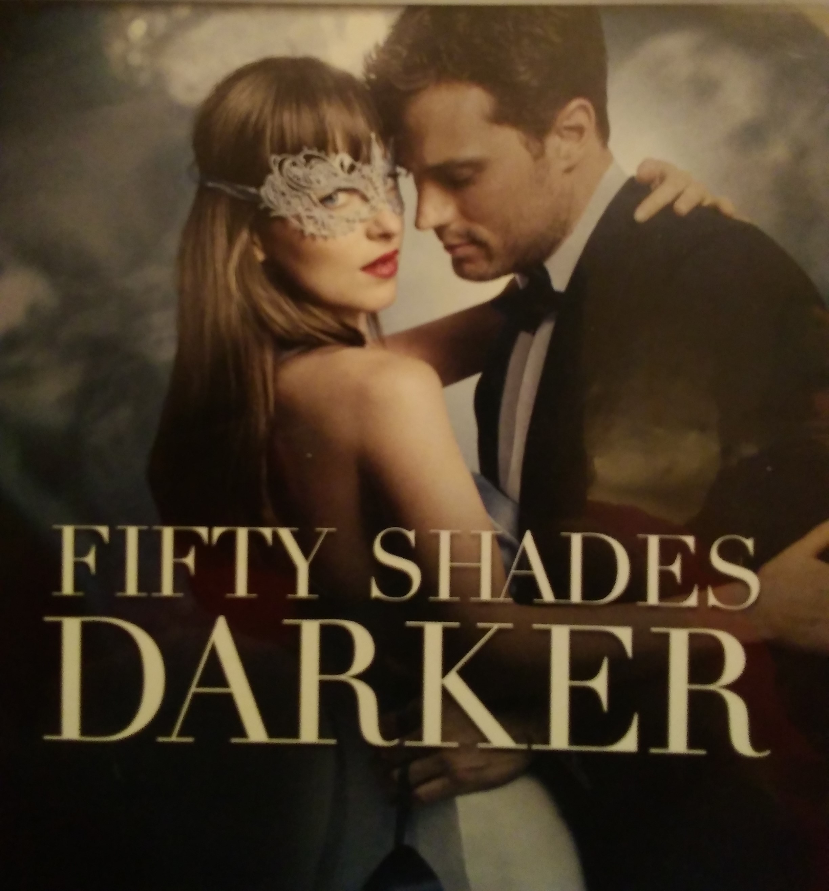

Teen Movies
===========

See our Selection below:

+-----------------------+------------+----------+-----------+---------+
| Film Title            | Year       | MPAA     | Run Time  | HAAB    |
|                       | Released   | Rating   |           | Review  |
+=======================+============+==========+===========+=========+
| :ref:`mean`           | 2017       | PG-13    | 1hr 52min | 6/10    |
+-----------------------+------------+----------+-----------+---------+
| :ref:`monster`        | 2017       | PG       | 2hr 09min | 8/10    |
+-----------------------+------------+----------+-----------+---------+
| :ref:`homeward`       | 2017       | R        | 1hr 55min | 5/10    |
+-----------------------+------------+----------+-----------+---------+

.. _mean:

Mean Girls 
----------
.. image:: /images/everything.jpg
    :width: 50%

*Description:*
~~~~~~~~~~~~~~

A teenage girl (Amandla Stenberg) is unable to leave her home because she 
has an immunodeficiency that makes her allergic to almost everything. 
However, her life changes for the better when she begins to communicate
with the boy next door (Nick Robinson). Everything, Everything was directed 
by Stella Meghie, and was adapted from the YA novel of the same name by 
Nicola Yoon.

**Starring:** Amandla Stenberg, Nick Robinson, Anika Noni Rose, 
Ana de la Reguera, Peter Benson, Taylor Hickson.

**Run Time:** 1hr 47min

**MPAA Rating:** Rated PG-13

Check out the trailer for `Mean Girls`!

.. _Mean Girls: https://www.youtube.com/watch?v=KAOmTMCtGkI

**If you like Everything, Everything, you may also like:**

* Love Actually
* La La Land
* The Proposal

.. _moster:

Monster TRuck
-------------

*Description:*
~~~~~~~~~~~~~~

Disney's "Beauty and the Beast" is a live-action re-telling of the studio's
animated classic which refashions the classic characters from the tale as
old as time for a contemporary audience, staying true to the original 
music while updating the score with several new songs. "Beauty and the
Beast" is the fantastic journey of Belle, a bright, beautiful and 
independent young woman who is taken prisoner by a beast in his castle. 
Despite her fears, she befriends the castle's enchanted staff and learns to
look beyond the Beast's hideous exterior and realize the kind heart and 
soul of the true Prince within..

**Starring:** Emma Watson, Dan Stevens (IV), Luke Evans, Kevin Kline,
Josh Gad, Ewan McGregor.

**Run Time:** 2hr 09min

**MPAA Rating:** Rated PG

Check out the trailer for `Monster Truck`!

.. _Monster Truck: https://www.youtube.com/watch?v=wQGawWqJdfs

**If you like Beatuy and the Beast, you may also like:**

* Pretty Woman
* Me before You
* The Fault in Our Stars

.. _homeward:

Homeward Bound 
--------------

*Description:*
~~~~~~~~~~~~~~

Anastasia has broken off her relationship with the troubled Christian to 
pursue a new career in a Seattle publishing house.

**Starring:** Dakota Johnson, Jamie Doran, Eric Johnson, Rita Ora, 
Luke Grimes, Dylan Neal.

**Run Time:** 1hr 55min

**MPAA Rating:** Rated R

Check out the trailer for `Fifty Shades Darker`_ !

.. _Fifty Shades Darker: https://www.youtube.com/watch?v=oQCyZKsT82M

**If you like Fifty Shades Darker, you may also like:**

* Fifty Shades of Grey
* 50 First Dates
* Ghost